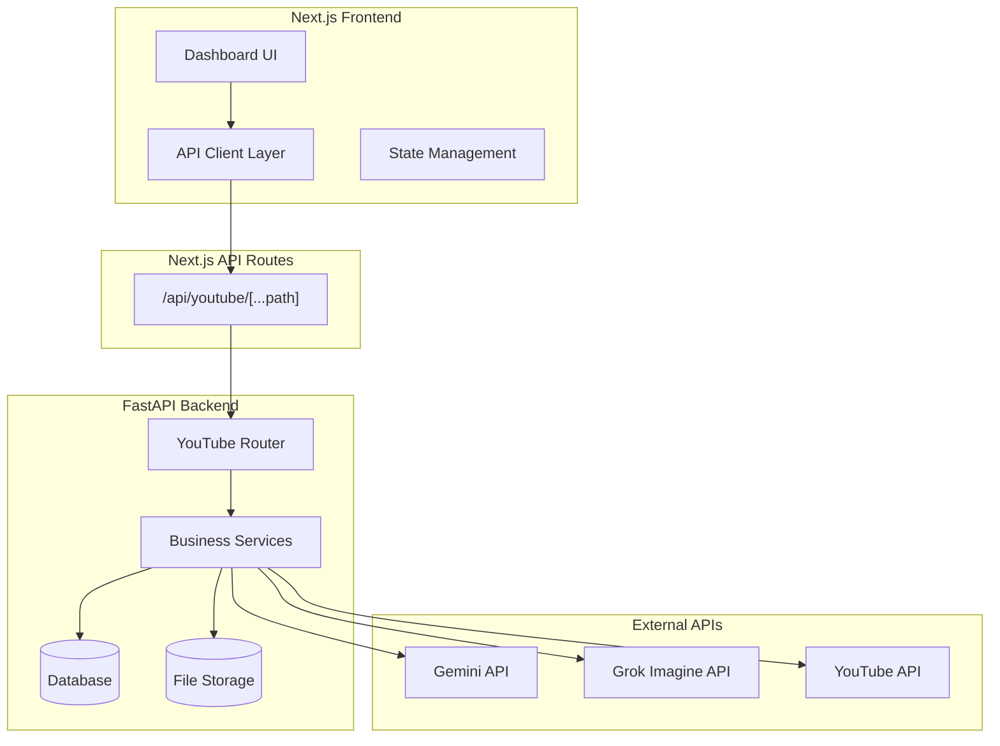

# Design Document: YouTube AI视频制作工具

## Overview

本设计文档详细描述YouTube AI视频制作工具的技术架构、API接口设计和前端页面设计。系统采用Next.js前端 + FastAPI后端的架构，通过Next.js API路由代理请求到FastAPI服务器。

## Architecture



## Components and Interfaces

### 前端页面结构

```
src/app/dashboard/youtube/
├── page.tsx                    # 重定向到projects页面
├── layout.tsx                  # YouTube模块布局
├── projects/
│   └── page.tsx               # 项目列表页面
├── project/
│   └── [projectId]/
│       └── page.tsx           # 项目详情/工作流页面
├── storyboard/
│   └── [projectId]/
│       └── page.tsx           # 源视频分镜查看页面（仅供参考）
├── prompts/
│   └── [projectId]/
│       └── page.tsx           # 提示词编辑页面（含角色引用管理）
├── generate/
│   └── [projectId]/
│       └── page.tsx           # 图片/视频生成页面
└── settings/
    └── page.tsx               # 通用设置页面
```


## Data Models

### TypeScript Types (Frontend)

```typescript
// src/types/youtube.ts

// 项目状态枚举
export type ProjectStatus = 
  | 'created'           // 刚创建
  | 'downloading'       // 下载中
  | 'downloaded'        // 下载完成
  | 'parsing'           // 解析分镜中
  | 'parsed'            // 分镜解析完成
  | 'generating_prompts'// 生成提示词中
  | 'prompts_ready'     // 提示词就绪
  | 'generating_images' // 生成图片中
  | 'images_ready'      // 图片就绪
  | 'generating_videos' // 生成视频中
  | 'completed'         // 全部完成
  | 'failed';           // 失败

// 视频项目
export interface VideoProject {
  id: string;
  name: string;
  youtube_url: string;
  status: ProjectStatus;
  video_path?: string;
  thumbnail_url?: string;
  duration?: number;
  created_at: string;
  updated_at: string;
  source_storyboard_count?: number;      // 源视频分镜数量
  innovation_storyboard_count?: number;  // 微创新视频分镜数量（来自提示词生成）
  prompt_version?: 'v1' | 'v2';
}

// 源视频分镜（仅供参考展示，不影响后续流程）
export interface SourceStoryboard {
  id: string;
  project_id: string;
  index: number;
  start_time: number;      // 秒
  end_time: number;        // 秒
  start_frame_url: string; // 首帧图片URL
  end_frame_url: string;   // 尾帧图片URL
  description?: string;    // 用户输入的内容描述
  created_at: string;
  updated_at: string;
}

// 角色映射（在Settings页面配置，供提示词引用）
export interface CharacterMapping {
  id: string;
  project_id: string;
  identifier: string;       // A, B, C, D 等标识
  reference_image_url?: string;  // 角色参考图片URL
  name?: string;            // 角色名称（可选）
}

// 提示词（对应微创新视频分镜）
export interface Prompt {
  id: string;
  project_id: string;
  storyboard_index: number;       // 微创新分镜序号
  text_to_image: string;          // 文生图/图文生图提示词
  image_to_video: string;         // 图生视频提示词
  character_refs?: string[];      // 角色引用标识 ['A', 'B', 'C']，最多3个
  version: 'v1' | 'v2';
  is_edited: boolean;
  edit_history?: PromptEditHistory[];
  created_at: string;
  updated_at: string;
}

// 提示词编辑历史
export interface PromptEditHistory {
  timestamp: string;
  text_to_image: string;
  image_to_video: string;
  edit_type: 'manual' | 'ai_regenerate';
}

// 生成的图片
export interface GeneratedImage {
  id: string;
  project_id: string;
  prompt_id: string;
  storyboard_index: number;
  image_url: string;
  generation_type: 'text_to_image' | 'image_text_to_image';  // 文生图 或 图文生图
  is_selected: boolean;
  created_at: string;
}

// 生成的视频
export interface GeneratedVideo {
  id: string;
  project_id: string;
  prompt_id: string;
  storyboard_index: number;
  source_image_id: string;  // 用户选择的图片ID
  video_url: string;
  is_selected: boolean;
  created_at: string;
}

// 生成任务
export interface GenerationTask {
  id: string;
  project_id: string;
  task_type: 'image' | 'video';
  status: 'pending' | 'running' | 'completed' | 'failed';
  progress: number;         // 0-100
  total_items: number;
  completed_items: number;
  failed_items: number;
  error_message?: string;
  created_at: string;
  updated_at: string;
}

// 结构化提示词JSON
export interface StructuredPromptData {
  project_id: string;
  project_name: string;
  total_innovation_storyboards: number;
  character_mappings: CharacterMapping[];
  prompts: {
    storyboard_index: number;
    text_to_image: string;
    image_to_video: string;
    character_refs: string[];
    character_images: { [key: string]: string };  // 角色标识 -> 图片URL
  }[];
}
```


## FastAPI接口设计

### API路由前缀: `/api/youtube`

### 1. 项目管理接口

```
POST   /projects                    # 创建项目
GET    /projects                    # 获取项目列表
GET    /projects/{project_id}       # 获取项目详情
PUT    /projects/{project_id}       # 更新项目
DELETE /projects/{project_id}       # 删除项目
```

#### POST /projects - 创建项目
**Request:**
```json
{
  "name": "我的视频项目",
  "youtube_url": "https://www.youtube.com/watch?v=xxxxx"
}
```
**Response:**
```json
{
  "id": "proj_123",
  "name": "我的视频项目",
  "youtube_url": "https://www.youtube.com/watch?v=xxxxx",
  "status": "created",
  "created_at": "2025-12-28T10:00:00Z"
}
```

#### GET /projects - 获取项目列表
**Query Params:** `page`, `page_size`, `status`
**Response:**
```json
{
  "data": [...],
  "total": 50,
  "page": 1,
  "page_size": 10
}
```

### 2. 视频下载接口

```
POST   /projects/{project_id}/download      # 开始下载视频
GET    /projects/{project_id}/download/status  # 获取下载状态
```

#### POST /projects/{project_id}/download
**Response:**
```json
{
  "task_id": "task_456",
  "status": "downloading",
  "message": "开始下载视频"
}
```

### 3. 分镜管理接口

```
POST   /projects/{project_id}/storyboards/parse    # 解析分镜
GET    /projects/{project_id}/storyboards          # 获取分镜列表
PUT    /storyboards/{storyboard_id}                # 更新分镜
DELETE /storyboards/{storyboard_id}                # 删除分镜
POST   /projects/{project_id}/storyboards          # 手动添加分镜
```

#### POST /projects/{project_id}/storyboards/parse
**Response:**
```json
{
  "task_id": "task_789",
  "status": "parsing",
  "message": "开始解析分镜"
}
```

#### GET /projects/{project_id}/storyboards
**Response:**
```json
{
  "data": [
    {
      "id": "sb_001",
      "index": 1,
      "start_time": 0,
      "end_time": 5.5,
      "start_frame_url": "/storage/frames/sb_001_start.jpg",
      "end_frame_url": "/storage/frames/sb_001_end.jpg",
      "description": null
    }
  ],
  "total": 15
}
```

#### PUT /storyboards/{storyboard_id}
**Request:**
```json
{
  "description": "主角走进房间",
  "start_time": 0,
  "end_time": 6.0
}
```


### 4. 提示词生成接口

```
POST   /projects/{project_id}/prompts/generate     # 生成提示词
GET    /projects/{project_id}/prompts              # 获取提示词列表
PUT    /prompts/{prompt_id}                        # 更新提示词
POST   /prompts/{prompt_id}/regenerate             # AI重新生成提示词
GET    /prompts/templates                          # 获取提示词模板列表
```

#### POST /projects/{project_id}/prompts/generate
**Request:**
```json
{
  "version": "v1",
  "include_storyboard_descriptions": true
}
```
**Response:**
```json
{
  "task_id": "task_gen_001",
  "status": "generating",
  "message": "正在调用Gemini API生成提示词"
}
```

#### GET /projects/{project_id}/prompts
**Response:**
```json
{
  "data": [
    {
      "id": "prompt_001",
      "storyboard_id": "sb_001",
      "storyboard_index": 1,
      "text_to_image": "A young man walking into a modern living room, cinematic lighting...",
      "image_to_video": "Camera slowly follows the character as he enters...",
      "character_refs": ["A"],
      "version": "v1",
      "is_edited": false
    }
  ],
  "total": 15
}
```

#### POST /prompts/{prompt_id}/regenerate
**Request:**
```json
{
  "instruction": "请让画面更加科幻感，增加霓虹灯效果",
  "regenerate_type": "both"  // "text_to_image" | "image_to_video" | "both"
}
```

### 5. 角色映射接口

```
GET    /projects/{project_id}/characters           # 获取角色映射
PUT    /projects/{project_id}/characters           # 更新角色映射
POST   /projects/{project_id}/characters/upload    # 上传角色参考图
```

#### PUT /projects/{project_id}/characters
**Request:**
```json
{
  "mappings": [
    { "number": 1, "identifier": "A", "name": "主角" },
    { "number": 2, "identifier": "B", "name": "配角" }
  ]
}
```

#### POST /projects/{project_id}/characters/upload
**Request:** multipart/form-data
- `identifier`: "A"
- `file`: 图片文件

### 6. 提示词结构化接口

```
POST   /projects/{project_id}/prompts/structure    # 结构化提示词
GET    /projects/{project_id}/prompts/export       # 导出JSON
```

#### GET /projects/{project_id}/prompts/export
**Response:**
```json
{
  "project_id": "proj_123",
  "project_name": "我的视频项目",
  "total_storyboards": 15,
  "character_mappings": [...],
  "prompts": [
    {
      "storyboard_index": 1,
      "text_to_image": "...",
      "image_to_video": "...",
      "character_refs": ["A"],
      "character_images": {
        "A": "/storage/characters/proj_123_A.jpg"
      }
    }
  ]
}
```


### 7. 图片生成接口

```
POST   /projects/{project_id}/images/generate      # 批量生成图片
GET    /projects/{project_id}/images               # 获取生成的图片
POST   /images/{image_id}/regenerate               # 重新生成单张图片
PUT    /images/{image_id}/select                   # 选择图片
GET    /projects/{project_id}/images/task/{task_id}  # 获取生成任务状态
```

#### POST /projects/{project_id}/images/generate
**Request:**
```json
{
  "storyboard_ids": ["sb_001", "sb_002"],  // 可选，不传则生成全部
  "parallel_count": 3                       // 并行数量
}
```
**Response:**
```json
{
  "task_id": "img_task_001",
  "status": "running",
  "total_items": 15,
  "message": "开始批量生成图片"
}
```

#### GET /projects/{project_id}/images
**Query Params:** `storyboard_id`, `is_selected`
**Response:**
```json
{
  "data": [
    {
      "id": "img_001",
      "storyboard_id": "sb_001",
      "prompt_id": "prompt_001",
      "image_url": "/storage/images/img_001.png",
      "generation_type": "image_to_image",
      "is_selected": true,
      "created_at": "2025-12-28T10:30:00Z"
    }
  ],
  "total": 45
}
```

#### PUT /images/{image_id}/select
**Request:**
```json
{
  "is_selected": true
}
```

### 8. 视频生成接口

```
POST   /projects/{project_id}/videos/generate      # 批量生成视频
GET    /projects/{project_id}/videos               # 获取生成的视频
POST   /videos/{video_id}/regenerate               # 重新生成单个视频
PUT    /videos/{video_id}/select                   # 选择视频
GET    /projects/{project_id}/videos/task/{task_id}  # 获取生成任务状态
POST   /projects/{project_id}/videos/download      # 批量下载选中视频
```

#### POST /projects/{project_id}/videos/generate
**Request:**
```json
{
  "storyboard_ids": ["sb_001", "sb_002"],
  "parallel_count": 2
}
```

#### POST /projects/{project_id}/videos/download
**Response:**
```json
{
  "download_url": "/storage/downloads/proj_123_videos.zip",
  "file_count": 15,
  "total_size": "256MB"
}
```

### 9. 任务状态接口

```
GET    /tasks/{task_id}                            # 获取任务状态
GET    /projects/{project_id}/tasks                # 获取项目所有任务
POST   /tasks/{task_id}/pause                      # 暂停任务
POST   /tasks/{task_id}/resume                     # 继续任务
POST   /tasks/{task_id}/cancel                     # 取消任务
```

#### GET /tasks/{task_id}
**Response:**
```json
{
  "id": "task_001",
  "project_id": "proj_123",
  "task_type": "image",
  "status": "running",
  "progress": 45,
  "total_items": 15,
  "completed_items": 7,
  "failed_items": 0,
  "created_at": "2025-12-28T10:00:00Z",
  "updated_at": "2025-12-28T10:15:00Z"
}
```


## 前端页面设计

### 页面1: 项目列表页 (`/dashboard/youtube/projects`)

**功能描述:** 显示所有视频项目，支持创建新项目

**页面布局:**
```
┌─────────────────────────────────────────────────────────────┐
│  YouTube AI视频工具                        [+ 创建项目]      │
├─────────────────────────────────────────────────────────────┤
│  筛选: [全部状态 ▼]  [搜索项目名称...]                       │
├─────────────────────────────────────────────────────────────┤
│  ┌──────────────┐  ┌──────────────┐  ┌──────────────┐       │
│  │  [缩略图]    │  │  [缩略图]    │  │  [缩略图]    │       │
│  │  项目名称    │  │  项目名称    │  │  项目名称    │       │
│  │  状态: 完成  │  │  状态: 生成中│  │  状态: 待处理│       │
│  │  源视频: 15  │  │  源视频: 12  │  │  源视频: --  │       │
│  │  微创新: 18  │  │  微创新: 15  │  │  微创新: --  │       │
│  │  [查看] [删除]│  │  [查看] [删除]│  │  [查看] [删除]│       │
│  └──────────────┘  └──────────────┘  └──────────────┘       │
│                                                             │
│  [< 上一页]  第1页/共5页  [下一页 >]                         │
└─────────────────────────────────────────────────────────────┘
```

**交互:**
- 点击"创建项目"弹出对话框，输入项目名称和YouTube URL
- 点击项目卡片进入项目详情页
- 支持按状态筛选和搜索
- 显示两个分镜数：源视频分镜数（来自分镜解析）和微创新分镜数（来自提示词生成）

### 页面2: 项目详情/工作流页面 (`/dashboard/youtube/project/[projectId]`)

**功能描述:** 显示项目工作流进度，引导用户完成各步骤

**页面布局:**
```
┌─────────────────────────────────────────────────────────────┐
│  ← 返回列表    项目: 我的视频项目                            │
├─────────────────────────────────────────────────────────────┤
│  工作流进度:                                                 │
│  ●────●────●────○────○                                      │
│  下载  分镜  提示词  图片  视频                               │
├─────────────────────────────────────────────────────────────┤
│  ┌─────────────────────────────────────────────────────────┐│
│  │ 步骤1: 视频下载                              [已完成 ✓] ││
│  │ YouTube URL: https://youtube.com/watch?v=xxx            ││
│  │ 视频时长: 5:32  |  文件大小: 128MB                       ││
│  └─────────────────────────────────────────────────────────┘│
│  ┌─────────────────────────────────────────────────────────┐│
│  │ 步骤2: 分镜解析（可选，仅供参考）            [已完成 ✓] ││
│  │ 已解析 15 个源视频分镜  [查看/编辑分镜 →]               ││
│  │ 注：源视频分镜仅供参考，不影响后续流程                   ││
│  └─────────────────────────────────────────────────────────┘│
│  ┌─────────────────────────────────────────────────────────┐│
│  │ 步骤3: 提示词编辑                            [进行中]   ││
│  │ 版本: [V1 ▼]  [生成提示词]                              ││
│  │ 已生成 18 个微创新分镜提示词                            ││
│  │ [编辑提示词和角色引用 →]                                ││
│  └─────────────────────────────────────────────────────────┘│
│  ┌─────────────────────────────────────────────────────────┐│
│  │ 步骤4: 图片生成                              [待开始]   ││
│  │ 前置条件：提示词编辑完成                                ││
│  │ [开始生成图片 →]                                        ││
│  └─────────────────────────────────────────────────────────┘│
│  ┌─────────────────────────────────────────────────────────┐│
│  │ 步骤5: 视频生成                              [待开始]   ││
│  │ 前置条件：所有分镜图片已生成且已选择                    ││
│  │ [开始生成视频 →]                                        ││
│  └─────────────────────────────────────────────────────────┘│
└─────────────────────────────────────────────────────────────┘
```


### 页面3: 源视频分镜查看页面 (`/dashboard/youtube/storyboard/[projectId]`)

**功能描述:** 查看源视频分镜（仅供参考，不影响后续流程）

**页面布局:**
```
┌─────────────────────────────────────────────────────────────┐
│  ← 返回项目    源视频分镜 - 共15个分镜（仅供参考）           │
│  注：源视频分镜仅供参考展示，不影响提示词生成和素材生成流程  │
├─────────────────────────────────────────────────────────────┤
│  ┌─────────────────────────────────────────────────────────┐│
│  │ 分镜 #1  [00:00 - 00:05]                    [调整时间]  ││
│  │ ┌────────────┐  ┌────────────┐                         ││
│  │ │ [首帧图片] │  │ [尾帧图片] │                         ││
│  │ └────────────┘  └────────────┘                         ││
│  │ 内容描述:                                               ││
│  │ ┌─────────────────────────────────────────────────────┐││
│  │ │ 主角走进现代风格的客厅，阳光从窗户洒入...           │││
│  │ └─────────────────────────────────────────────────────┘││
│  │                                              [保存]    ││
│  └─────────────────────────────────────────────────────────┘│
│  ┌─────────────────────────────────────────────────────────┐│
│  │ 分镜 #2  [00:05 - 00:12]                    [调整时间]  ││
│  │ ┌────────────┐  ┌────────────┐                         ││
│  │ │ [首帧图片] │  │ [尾帧图片] │                         ││
│  │ └────────────┘  └────────────┘                         ││
│  │ 内容描述:                                               ││
│  │ ┌─────────────────────────────────────────────────────┐││
│  │ │ (请输入该分镜的内容描述...)                         │││
│  │ └─────────────────────────────────────────────────────┘││
│  └─────────────────────────────────────────────────────────┘│
│  ...更多分镜...                                             │
│                                                             │
│  [批量保存所有描述]                    [继续下一步: 生成提示词]│
└─────────────────────────────────────────────────────────────┘
```

### 页面4: 提示词编辑页面 (`/dashboard/youtube/prompts/[projectId]`)

**功能描述:** 查看、编辑提示词和管理角色引用（不显示分镜缩略图）

**页面布局:**
```
┌─────────────────────────────────────────────────────────────┐
│  ← 返回项目    提示词编辑 - 共18个微创新分镜                 │
│  版本: [V1 ○] [V2 ●]  [切换版本重新生成]                     │
├─────────────────────────────────────────────────────────────┤
│  ┌─────────────────────────────────────────────────────────┐│
│  │ 微创新分镜 #1                               [已编辑 ✎] ││
│  │                                                         ││
│  │ 文生图提示词:                                           ││
│  │ ┌───────────────────────────────────────────────────┐  ││
│  │ │ A young man walking into a modern living room,   │  ││
│  │ │ cinematic lighting, 8k resolution...             │  ││
│  │ └───────────────────────────────────────────────────┘  ││
│  │                                                         ││
│  │ 图生视频提示词:                                         ││
│  │ ┌───────────────────────────────────────────────────┐  ││
│  │ │ Camera slowly follows the character as he        │  ││
│  │ │ enters...                                        │  ││
│  │ └───────────────────────────────────────────────────┘  ││
│  │                                                         ││
│  │ 角色引用 (最多3个): [A: 主角] [B: 配角] [+ 添加]        ││
│  │ ┌────────┐ ┌────────┐                                  ││
│  │ │[角色A] │ │[角色B] │  [删除A] [删除B]                 ││
│  │ └────────┘ └────────┘                                  ││
│  │                                                         ││
│  │ [编辑] [AI重新生成] [查看历史]                          ││
│  └─────────────────────────────────────────────────────────┘│
│  ...更多提示词...                                           │
│                                                             │
│  [导出JSON]                           [继续下一步: 图片生成] │
└─────────────────────────────────────────────────────────────┘
```

**编辑对话框:**
```
┌─────────────────────────────────────────────────────────────┐
│  编辑提示词 - 微创新分镜 #1                            [×]  │
├─────────────────────────────────────────────────────────────┤
│  文生图提示词:                                              │
│  ┌─────────────────────────────────────────────────────────┐│
│  │ A young man walking into a modern living room...       ││
│  │                                                         ││
│  └─────────────────────────────────────────────────────────┘│
│  图生视频提示词:                                            │
│  ┌─────────────────────────────────────────────────────────┐│
│  │ Camera slowly follows the character...                 ││
│  │                                                         ││
│  └─────────────────────────────────────────────────────────┘│
│                                                             │
│  ─── 角色引用 (最多3个，从Settings配置中选择) ───           │
│  可用角色: [A: 主角 ✓] [B: 配角 ✓] [C: 路人] [D: 反派]     │
│  已选择: A, B                                               │
│                                                             │
│  ─── 或使用AI重新生成 ───                                   │
│  修改建议:                                                  │
│  ┌─────────────────────────────────────────────────────────┐│
│  │ 请让画面更加科幻感，增加霓虹灯效果                      ││
│  └─────────────────────────────────────────────────────────┘│
│  [AI重新生成]                                               │
│                                                             │
│                              [取消]  [保存修改]             │
└─────────────────────────────────────────────────────────────┘
```

**角色引用说明:**
- 角色在 Settings 页面配置（上传参考图）
- 提示词编辑页面可选择引用已配置的角色（最多3个）
- 角色引用图片将作为图片生成时"图文生图"接口的传入图片（最多3张）
- 如果没有角色引用，则调用纯"文生图"接口


### 页面5: 角色映射配置页面 (`/dashboard/youtube/settings`)

**功能描述:** 配置角色参考图，供提示词编辑时引用

**页面布局:**
```
┌─────────────────────────────────────────────────────────────┐
│  角色映射配置                                                │
├─────────────────────────────────────────────────────────────┤
│  当前项目: [选择项目 ▼]                                      │
├─────────────────────────────────────────────────────────────┤
│  ┌─────────────────────────────────────────────────────────┐│
│  │ 角色 A                                                  ││
│  │ 名称: [主角        ]                                   ││
│  │ 参考图: ┌────────┐  [上传图片]                         ││
│  │         │ [图片] │                                     ││
│  │         └────────┘                                     ││
│  └─────────────────────────────────────────────────────────┘│
│  ┌─────────────────────────────────────────────────────────┐│
│  │ 角色 B                                                  ││
│  │ 名称: [配角        ]                                   ││
│  │ 参考图: ┌────────┐  [上传图片]                         ││
│  │         │ [空]   │                                     ││
│  │         └────────┘                                     ││
│  └─────────────────────────────────────────────────────────┘│
│  ┌─────────────────────────────────────────────────────────┐│
│  │ 角色 C                                                  ││
│  │ 名称: [          ]                                     ││
│  │ 参考图: [上传图片]                                     ││
│  └─────────────────────────────────────────────────────────┘│
│  ┌─────────────────────────────────────────────────────────┐│
│  │ 角色 D                                                  ││
│  │ 名称: [          ]                                     ││
│  │ 参考图: [上传图片]                                     ││
│  └─────────────────────────────────────────────────────────┘│
│                                                             │
│  [+ 添加更多角色]                                            │
│                                                             │
│  [重置为默认]                              [保存配置]        │
└─────────────────────────────────────────────────────────────┘
```

**说明:**
- 角色映射配置不再是工作流的一个步骤，而是在 Settings 页面独立管理
- 配置的角色参考图可在提示词编辑页面被引用
- 图片生成时，每个分镜最多支持3个角色参考图上传到图文生图接口

### 页面6: 图片/视频生成页面 (`/dashboard/youtube/generate/[projectId]`)

**功能描述:** 批量生成图片和视频，选择最终素材

**前置条件:**
- 图片生成：提示词编辑完成（角色引用可选）
- 视频生成：提示词完成 + 所有分镜图片已生成 + 用户已为每个分镜选择一张图片

**图片生成逻辑:**
- 有角色引用 → 调用图文生图接口（最多3张角色参考图 + text_to_image提示词）
- 无角色引用 → 调用纯文生图接口（仅text_to_image提示词）

**视频生成逻辑:**
- 输入图片：用户选择的图片
- 输入文本：对应的 image_to_video 提示词

**页面布局:**
```
┌─────────────────────────────────────────────────────────────┐
│  ← 返回项目    素材生成                                      │
│  [图片生成] [视频生成]                                       │
├─────────────────────────────────────────────────────────────┤
│  生成进度: ████████████░░░░░░░░  60% (11/18)                │
│  [暂停] [继续] [取消]                                        │
├─────────────────────────────────────────────────────────────┤
│  ┌─────────────────────────────────────────────────────────┐│
│  │ 微创新分镜 #1                               [已选择 ✓] ││
│  │ 生成方式: 图文生图 (角色: A, B)                         ││
│  │ ┌────────┐ ┌────────┐ ┌────────┐ ┌────────┐            ││
│  │ │[图片1] │ │[图片2] │ │[图片3] │ │ [+]    │            ││
│  │ │  ✓选中 │ │        │ │        │ │重新生成│            ││
│  │ └────────┘ └────────┘ └────────┘ └────────┘            ││
│  └─────────────────────────────────────────────────────────┘│
│  ┌─────────────────────────────────────────────────────────┐│
│  │ 微创新分镜 #2                               [生成中...] ││
│  │ 生成方式: 文生图 (无角色引用)                           ││
│  │ ┌────────┐ ┌────────┐                                  ││
│  │ │[图片1] │ │ ⟳     │                                  ││
│  │ │        │ │生成中  │                                  ││
│  │ └────────┘ └────────┘                                  ││
│  └─────────────────────────────────────────────────────────┘│
│  ┌─────────────────────────────────────────────────────────┐│
│  │ 微创新分镜 #3                               [待生成]   ││
│  │ 生成方式: 图文生图 (角色: A, B, C)                      ││
│  │ [开始生成]                                             ││
│  └─────────────────────────────────────────────────────────┘│
│  ...更多分镜...                                             │
│                                                             │
│  已选择: 11/18 个分镜                                       │
│  [批量生成剩余]                    [继续下一步: 视频生成]    │
└─────────────────────────────────────────────────────────────┘
```

**视频生成Tab:**
```
┌─────────────────────────────────────────────────────────────┐
│  ← 返回项目    素材生成                                      │
│  [图片生成] [视频生成]                                       │
├─────────────────────────────────────────────────────────────┤
│  前置条件检查:                                               │
│  ✓ 提示词已完成 (18个)                                      │
│  ✓ 所有分镜图片已生成                                       │
│  ✓ 所有分镜已选择图片 (18/18)                               │
├─────────────────────────────────────────────────────────────┤
│  生成进度: ████████░░░░░░░░░░░░  40% (7/18)                 │
├─────────────────────────────────────────────────────────────┤
│  ┌─────────────────────────────────────────────────────────┐│
│  │ 微创新分镜 #1                               [已选择 ✓] ││
│  │ 源图片: [用户选择的图片缩略图]                          ││
│  │ 提示词: Camera slowly follows the character...         ││
│  │ ┌────────┐ ┌────────┐ ┌────────┐                       ││
│  │ │[视频1] │ │[视频2] │ │ [+]    │                       ││
│  │ │ ▶ 播放 │ │ ▶ 播放 │ │重新生成│                       ││
│  │ │  ✓选中 │ │        │ │        │                       ││
│  │ └────────┘ └────────┘ └────────┘                       ││
│  └─────────────────────────────────────────────────────────┘│
│  ...更多分镜...                                             │
│                                                             │
│  已选择: 7/18 个视频                                        │
│  [批量生成剩余]                         [下载所有选中视频]   │
└─────────────────────────────────────────────────────────────┘
```


## Error Handling

### API错误处理

1. **网络错误**: 显示"无法连接到服务器"提示，提供重试按钮
2. **超时错误**: 显示"请求超时"提示，建议检查网络或稍后重试
3. **验证错误**: 显示具体的字段验证错误信息
4. **业务错误**: 显示后端返回的错误消息
5. **外部API错误**: 
   - Gemini API失败: 显示"AI服务暂时不可用"，允许重试
   - Grok API失败: 显示"视频生成服务暂时不可用"，允许重试
   - YouTube下载失败: 显示"视频下载失败"，检查URL有效性

### 前端错误边界

```typescript
// 每个页面组件包装错误边界
<ErrorBoundary fallback={<ErrorFallback />}>
  <PageComponent />
</ErrorBoundary>
```

### 任务失败处理

1. 单个分镜生成失败不影响其他分镜
2. 失败的任务显示错误原因
3. 提供单独重试按钮
4. 批量任务支持"跳过失败项继续"选项

## Correctness Properties

*A property is a characteristic or behavior that should hold true across all valid executions of a system-essentially, a formal statement about what the system should do. Properties serve as the bridge between human-readable specifications and machine-verifiable correctness guarantees.*

### Property 1: YouTube URL验证正确性
*For any* 字符串输入，URL验证函数应该正确识别有效的YouTube视频URL格式（包含youtube.com/watch?v=或youtu.be/），并拒绝无效格式。
**Validates: Requirements 1.2**

### Property 2: 项目CRUD一致性
*For any* 创建的项目，查询该项目应返回相同的数据；删除后查询应返回404或空结果。
**Validates: Requirements 1.1, 1.3, 1.4**

### Property 3: 源视频分镜数据完整性
*For any* 源视频分镜列表查询，返回的每个分镜必须包含首帧URL和尾帧URL，且start_time < end_time。
**Validates: Requirements 2.3, 2.5, 2.6**

### Property 4: 源视频分镜更新持久性
*For any* 源视频分镜描述或时间边界的更新，保存后再次查询应返回更新后的值。
**Validates: Requirements 2.4, 2.5**

### Property 5: 微创新分镜提示词完整性
*For any* 项目的提示词生成完成后，每个提示词必须包含text_to_image和image_to_video两个字段，微创新分镜数量由AI决定。
**Validates: Requirements 3.2, 3.3, 4.1**

### Property 6: 提示词版本切换
*For any* 版本切换操作，生成的提示词version字段应与选择的版本一致。
**Validates: Requirements 3.4, 3.5**

### Property 7: 提示词保存与历史追踪
*For any* 提示词修改操作，保存后查询应返回更新后的值，且edit_history数组长度应增加1。
**Validates: Requirements 4.4, 4.5**

### Property 8: 角色引用应用
*For any* 包含角色引用的提示词，导出的JSON中character_refs字段应包含对应角色的图片路径。
**Validates: Requirements 4.6, 4.7, 5.3**

### Property 9: JSON结构完整性
*For any* 导出的结构化JSON，必须包含project_id、project_name、total_innovation_storyboards和prompts字段，且prompts数组中每项包含storyboard_index、text_to_image、image_to_video。
**Validates: Requirements 5.1, 5.2, 5.4**

### Property 10: 生成类型选择正确性
*For any* 图片生成请求，如果对应提示词包含角色引用，则generation_type应为image_text_to_image；否则应为text_to_image。
**Validates: Requirements 6.2, 6.3**

### Property 11: 重新生成增加候选
*For any* 图片或视频的重新生成操作，该分镜的候选列表长度应增加。
**Validates: Requirements 6.5, 7.3**

### Property 12: 选择标记唯一性
*For any* 分镜的图片或视频选择操作，同一分镜下只能有一个is_selected为true的项。
**Validates: Requirements 6.6, 7.4**

### Property 13: 任务进度计算正确性
*For any* 生成任务，progress百分比应等于(completed_items / total_items) * 100，且completed_items + failed_items <= total_items。
**Validates: Requirements 8.1, 8.2**

### Property 14: 任务状态持久化
*For any* 任务状态查询，无论是否刷新页面，返回的状态应与实际任务状态一致。
**Validates: Requirements 8.4, 8.5**

### Property 15: 视频生成前置条件
*For any* 视频生成请求，必须满足：提示词编辑完成 + 所有分镜图片已生成 + 用户已为每个分镜选择一张图片。
**Validates: Requirements 7.7**

### Property 16: 项目列表分镜数显示
*For any* 项目列表查询，每个项目应显示两个分镜数：源视频分镜数和微创新分镜数（如果已生成提示词）。
**Validates: Requirements 1.6**

## Testing Strategy

### 单元测试
- URL验证函数测试
- 数据模型验证测试
- 状态转换逻辑测试
- 进度计算函数测试

### 集成测试
- API端点测试（使用mock外部服务）
- 数据库CRUD操作测试
- 文件上传/下载测试

### Property-Based Testing
使用 `fast-check` 库进行属性测试：
- 最少100次迭代
- 每个测试标注对应的设计属性
- 标签格式: **Feature: youtube-video-tool, Property {number}: {property_text}**

### E2E测试
- 完整工作流测试（创建项目→下载→分镜→提示词→生成）
- 错误恢复测试
- 并发操作测试
