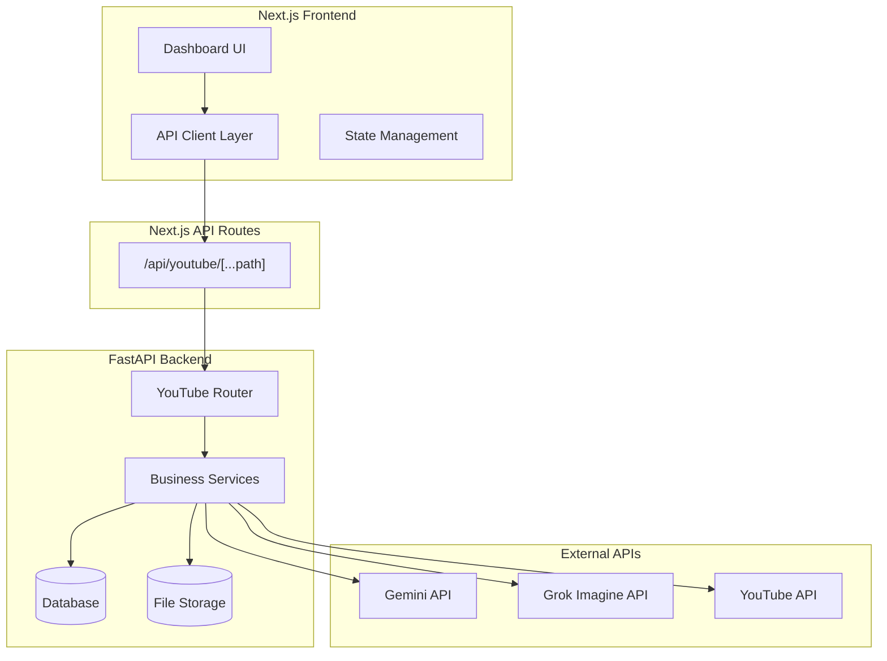

# Design Document: YouTube AI视频制作工具

## Overview

本设计文档详细描述YouTube AI视频制作工具的技术架构、API接口设计和前端页面设计。系统采用Next.js前端 + FastAPI后端的架构，通过Next.js API路由代理请求到FastAPI服务器。

## Architecture


```mermaid
graph TB
    subgraph Frontend["Next.js Frontend"]
        UI[Dashboard UI]
        API_Client[API Client Layer]
        State[State Management]
    end
    
    subgraph API_Proxy["Next.js API Routes"]
        Proxy["/api/youtube/[...path]"]
    end
    
    subgraph Backend["FastAPI Backend"]
        Router[YouTube Router]
        Services[Business Services]
        DB[(Database)]
        Storage[(File Storage)]
    end
    
    subgraph External["External APIs"]
        Gemini[Gemini API]
        Grok[Grok Imagine API]
        YT[YouTube API]
    end
    
    UI --> API_Client
    API_Client --> Proxy
    Proxy --> Router
    Router --> Services
    Services --> DB
    Services --> Storage
    Services --> Gemini
    Services --> Grok
    Services --> YT
```

## Components and Interfaces

### 前端页面结构

```
src/app/dashboard/youtube/
├── page.tsx                    # 重定向到projects页面
├── layout.tsx                  # YouTube模块布局
├── projects/
│   └── page.tsx               # 项目列表页面
├── project/
│   └── [projectId]/
│       └── page.tsx           # 项目详情/工作流页面
├── storyboard/
│   └── [projectId]/
│       └── page.tsx           # 源视频分镜查看页面（仅供参考）
├── prompts/
│   └── [projectId]/
│       └── page.tsx           # 提示词编辑页面（含角色引用管理）
├── generate/
│   └── [projectId]/
│       └── page.tsx           # 图片/视频生成页面
└── settings/
    └── page.tsx               # 通用设置页面
```


## Data Models

### TypeScript Types (Frontend)

```typescript
// src/types/youtube.ts

// 项目状态枚举
export type ProjectStatus = 
  | 'created'           // 刚创建
  | 'downloading'       // 下载中
  | 'downloaded'        // 下载完成
  | 'parsing'           // 解析分镜中
  | 'parsed'            // 分镜解析完成
  | 'generating_prompts'// 生成提示词中
  | 'prompts_ready'     // 提示词就绪
  | 'generating_images' // 生成图片中
  | 'images_ready'      // 图片就绪
  | 'generating_videos' // 生成视频中
  | 'completed'         // 全部完成
  | 'failed';           // 失败

// 视频项目
export interface VideoProject {
  id: string;
  name: string;
  youtube_url: string;
  status: ProjectStatus;
  video_path?: string;
  thumbnail_url?: string;
  duration?: number;
  created_at: string;
  updated_at: string;
  source_storyboard_count?: number;      // 源视频分镜数量
  innovation_storyboard_count?: number;  // 微创新视频分镜数量（来自提示词生成）
  prompt_version?: 'v1' | 'v2';
}

// 源视频分镜（仅供参考展示，不影响后续流程）
export interface SourceStoryboard {
  id: string;
  project_id: string;
  index: number;
  start_time: number;      // 秒
  end_time: number;        // 秒
  start_frame_url: string; // 首帧图片URL
  end_frame_url: string;   // 尾帧图片URL
  description?: string;    // 用户输入的内容描述
  created_at: string;
  updated_at: string;
}

// 角色映射（在Settings页面配置，供提示词引用）
export interface CharacterMapping {
  id: string;
  project_id: string;
  identifier: string;       // A, B, C, D 等标识
  reference_image_url?: string;  // 角色参考图片URL
  name?: string;            // 角色名称（可选）
}

// 提示词（对应微创新视频分镜）
export interface Prompt {
  id: string;
  project_id: string;
  storyboard_index: number;       // 微创新分镜序号
  text_to_image: string;          // 文生图/图文生图提示词
  image_to_video: string;         // 图生视频提示词
  character_refs?: string[];      // 角色引用标识 ['A', 'B', 'C']，最多3个
  version: 'v1' | 'v2';
  is_edited: boolean;
  edit_history?: PromptEditHistory[];
  created_at: string;
  updated_at: string;
}

// 提示词编辑历史
export interface PromptEditHistory {
  timestamp: string;
  text_to_image: string;
  image_to_video: string;
  edit_type: 'manual' | 'ai_regenerate';
}

// 生成的图片
export interface GeneratedImage {
  id: string;
  project_id: string;
  prompt_id: string;
  storyboard_index: number;
  image_url: string;
  generation_type: 'text_to_image' | 'image_text_to_image';  // 文生图 或 图文生图
  is_selected: boolean;
  task_id?: string;         // 关联的异步任务ID
  created_at: string;
}

// 生成的视频
export interface GeneratedVideo {
  id: string;
  project_id: string;
  prompt_id: string;
  storyboard_index: number;
  source_image_id: string;  // 用户选择的图片ID
  video_url: string;
  is_selected: boolean;
  task_id?: string;         // 关联的异步任务ID
  created_at: string;
}

// 异步任务（基于任务队列系统）
export interface AsyncTask {
  task_id: string;
  module_name: 'image_generation' | 'video_generation';
  task_type: 'generate_storyboard_image' | 'generate_storyboard_video';
  status: 'pending' | 'running' | 'completed' | 'failed' | 'cancelled';
  progress: number;         // 0-100
  created_at: string;
  started_at: string | null;
  completed_at: string | null;
  error_message: string | null;
  has_result: boolean;
}

// 批量任务状态查询响应
export interface BatchTaskStatusResponse {
  success: boolean;
  tasks: AsyncTask[];
  not_found: string[];      // 不存在的task_id列表
}

// 模块状态响应
export interface ModuleStatusResponse {
  status: 'running' | 'idle';
  queue_processing: boolean;
  queue_size: number;
  message: string;
  module_name: string;
  total_tasks: number;
  completed_tasks: number;
  failed_tasks: number;
  pending_tasks: number;
  running_tasks: number;
  completion_percentage: number;
  automation_info: {
    is_busy: boolean;
    can_add_new_tasks: boolean;
    auto_reset_enabled: boolean;
  };
}

// 结构化提示词JSON
export interface StructuredPromptData {
  project_id: string;
  project_name: string;
  total_innovation_storyboards: number;
  character_mappings: CharacterMapping[];
  prompts: {
    storyboard_index: number;
    text_to_image: string;
    image_to_video: string;
    character_refs: string[];
    character_images: { [key: string]: string };  // 角色标识 -> 图片URL
  }[];
}

// 主体类型（V2新增）
export type SubjectType = 'character' | 'object' | 'scene';

// 全局主体（服务端存储，V2新增）
export interface Subject {
  id: string;                    // UUID
  type: SubjectType;             // 主体类型：角色/物品/场景
  name?: string;                 // 主体名称
  description?: string | null;   // 主体描述，用于区分同类型的多个主体
  image_url?: string;            // 主体参考图片URL
  user_id?: string;              // 用户ID（可选）
  created_at: string;            // 创建时间
  updated_at: string;            // 更新时间
}

// 主体列表响应
export interface SubjectListResponse {
  subjects: Subject[];
  total: number;
}
```


## FastAPI接口设计

### API路由前缀: `/api/youtube`

### 1. 项目管理接口

```
POST   /projects                    # 创建项目
GET    /projects                    # 获取项目列表
GET    /projects/{project_id}       # 获取项目详情
PUT    /projects/{project_id}       # 更新项目
DELETE /projects/{project_id}       # 删除项目
```

#### POST /projects - 创建项目
**Request:**
```json
{
  "name": "我的视频项目",
  "youtube_url": "https://www.youtube.com/watch?v=xxxxx"
}
```
**Response:**
```json
{
  "id": "proj_123",
  "name": "我的视频项目",
  "youtube_url": "https://www.youtube.com/watch?v=xxxxx",
  "status": "created",
  "created_at": "2025-12-28T10:00:00Z"
}
```

#### GET /projects - 获取项目列表
**Query Params:** `page`, `page_size`, `status`
**Response:**
```json
{
  "data": [...],
  "total": 50,
  "page": 1,
  "page_size": 10
}
```

### 2. 视频下载接口

```
POST   /projects/{project_id}/download      # 开始下载视频
GET    /projects/{project_id}/download/status  # 获取下载状态
```

#### POST /projects/{project_id}/download
**Response:**
```json
{
  "task_id": "task_456",
  "status": "downloading",
  "message": "开始下载视频"
}
```

### 3. 分镜管理接口

```
POST   /projects/{project_id}/storyboards/parse    # 解析分镜
GET    /projects/{project_id}/storyboards          # 获取分镜列表
PUT    /storyboards/{storyboard_id}                # 更新分镜
DELETE /storyboards/{storyboard_id}                # 删除分镜
POST   /projects/{project_id}/storyboards          # 手动添加分镜
```

#### POST /projects/{project_id}/storyboards/parse
**Response:**
```json
{
  "task_id": "task_789",
  "status": "parsing",
  "message": "开始解析分镜"
}
```

#### GET /projects/{project_id}/storyboards
**Response:**
```json
{
  "data": [
    {
      "id": "sb_001",
      "index": 1,
      "start_time": 0,
      "end_time": 5.5,
      "start_frame_url": "/storage/frames/sb_001_start.jpg",
      "end_frame_url": "/storage/frames/sb_001_end.jpg",
      "description": null
    }
  ],
  "total": 15
}
```

#### PUT /storyboards/{storyboard_id}
**Request:**
```json
{
  "description": "主角走进房间",
  "start_time": 0,
  "end_time": 6.0
}
```


### 4. 提示词生成接口

```
POST   /projects/{project_id}/prompts/generate     # 生成提示词
GET    /projects/{project_id}/prompts              # 获取提示词列表
PUT    /prompts/{prompt_id}                        # 更新提示词
POST   /prompts/{prompt_id}/regenerate             # AI重新生成提示词
GET    /prompts/templates                          # 获取提示词模板列表
```

#### POST /projects/{project_id}/prompts/generate
**Request:**
```json
{
  "version": "v1",
  "include_storyboard_descriptions": true
}
```
**Response:**
```json
{
  "task_id": "task_gen_001",
  "status": "generating",
  "message": "正在调用Gemini API生成提示词"
}
```

#### GET /projects/{project_id}/prompts
**Response:**
```json
{
  "data": [
    {
      "id": "prompt_001",
      "storyboard_id": "sb_001",
      "storyboard_index": 1,
      "text_to_image": "A young man walking into a modern living room, cinematic lighting...",
      "image_to_video": "Camera slowly follows the character as he enters...",
      "character_refs": ["A"],
      "version": "v1",
      "is_edited": false
    }
  ],
  "total": 15
}
```

#### POST /prompts/{prompt_id}/regenerate
**Request:**
```json
{
  "instruction": "请让画面更加科幻感，增加霓虹灯效果",
  "regenerate_type": "both"  // "text_to_image" | "image_to_video" | "both"
}
```

### 5. 角色映射接口

```
GET    /projects/{project_id}/characters           # 获取角色映射
PUT    /projects/{project_id}/characters           # 更新角色映射
POST   /projects/{project_id}/characters/upload    # 上传角色参考图
```

#### PUT /projects/{project_id}/characters
**Request:**
```json
{
  "mappings": [
    { "number": 1, "identifier": "A", "name": "主角" },
    { "number": 2, "identifier": "B", "name": "配角" }
  ]
}
```

#### POST /projects/{project_id}/characters/upload
**Request:** multipart/form-data
- `identifier`: "A"
- `file`: 图片文件

### 6. 提示词结构化接口

```
POST   /projects/{project_id}/prompts/structure    # 结构化提示词
GET    /projects/{project_id}/prompts/export       # 导出JSON
```

#### GET /projects/{project_id}/prompts/export
**Response:**
```json
{
  "project_id": "proj_123",
  "project_name": "我的视频项目",
  "total_storyboards": 15,
  "character_mappings": [...],
  "prompts": [
    {
      "storyboard_index": 1,
      "text_to_image": "...",
      "image_to_video": "...",
      "character_refs": ["A"],
      "character_images": {
        "A": "/storage/characters/proj_123_A.jpg"
      }
    }
  ]
}
```


### 7. 图片生成接口（异步队列模式）

```
POST   /api/tasks/create                                    # 创建图片生成任务
GET    /api/tasks/{task_id}                                 # 查询单个任务状态
POST   /api/tasks/batch-status                              # 批量查询任务状态
GET    /api/youtube/projects/{project_id}/generation-tasks  # 查询项目任务列表
POST   /images/{image_id}/regenerate                        # 重新生成单张图片（创建新任务）
PUT    /images/{image_id}/select                            # 选择图片
```

#### POST /api/tasks/create - 创建图片生成任务
**Request:**
```json
{
  "module_name": "image_generation",
  "task_type": "generate_storyboard_image",
  "execution_mode": "sequential",
  "data": {
    "project_id": "proj_123",
    "storyboard_index": 0,
    "prompt": "A beautiful sunset over mountains",
    "character_images": ["https://example.com/char1.jpg", "https://example.com/char2.jpg"],
    "aspect_ratio": "9:16",
    "subject_mappings": {"角色A": "character_1"},
    "ref_storyboard_indexes": [1, 2],
    "ai_channel": "business"
  }
}
```
**Response - 成功:**
```json
{
  "success": true,
  "task_id": "image_generation_generate_storyboard_image_1234567890_abc123",
  "message": "任务已创建并添加到 image_generation 队列"
}
```
**Response - 模块忙碌 (HTTP 409):**
```json
{
  "detail": "模块 image_generation 正在执行任务,无法添加新任务。原因: 处理器正在运行, 队列中有 5 个任务。请等待当前任务完成后再试。"
}
```

#### GET /api/tasks/{task_id} - 查询单个任务状态
**Response - pending状态:**
```json
{
  "task_id": "image_generation_generate_storyboard_image_1234567890_abc123",
  "module_name": "image_generation",
  "task_type": "generate_storyboard_image",
  "status": "pending",
  "progress": 0,
  "created_at": "2024-01-01T10:00:00",
  "started_at": null,
  "completed_at": null,
  "error_message": null,
  "has_result": false
}
```
**Response - running状态:**
```json
{
  "task_id": "image_generation_generate_storyboard_image_1234567890_abc123",
  "module_name": "image_generation",
  "task_type": "generate_storyboard_image",
  "status": "running",
  "progress": 50,
  "created_at": "2024-01-01T10:00:00",
  "started_at": "2024-01-01T10:00:05",
  "completed_at": null,
  "error_message": null,
  "has_result": false
}
```
**Response - completed状态:**
```json
{
  "task_id": "image_generation_generate_storyboard_image_1234567890_abc123",
  "module_name": "image_generation",
  "task_type": "generate_storyboard_image",
  "status": "completed",
  "progress": 100,
  "created_at": "2024-01-01T10:00:00",
  "started_at": "2024-01-01T10:00:05",
  "completed_at": "2024-01-01T10:00:30",
  "error_message": null,
  "has_result": true
}
```
**Response - failed状态:**
```json
{
  "task_id": "image_generation_generate_storyboard_image_1234567890_abc123",
  "module_name": "image_generation",
  "task_type": "generate_storyboard_image",
  "status": "failed",
  "progress": 0,
  "created_at": "2024-01-01T10:00:00",
  "started_at": "2024-01-01T10:00:05",
  "completed_at": "2024-01-01T10:00:10",
  "error_message": "图片生成失败: API rate limit exceeded",
  "has_result": false
}
```

#### POST /api/tasks/batch-status - 批量查询任务状态
**Request:**
```json
{
  "task_ids": [
    "image_generation_generate_storyboard_image_1234567890_abc123",
    "image_generation_generate_storyboard_image_1234567891_def456"
  ]
}
```
**Response:**
```json
{
  "success": true,
  "tasks": [
    {
      "task_id": "image_generation_generate_storyboard_image_1234567890_abc123",
      "module_name": "image_generation",
      "task_type": "generate_storyboard_image",
      "status": "completed",
      "progress": 100,
      "created_at": "2024-01-01T10:00:00",
      "started_at": "2024-01-01T10:00:05",
      "completed_at": "2024-01-01T10:00:30",
      "error_message": null,
      "has_result": true
    },
    {
      "task_id": "image_generation_generate_storyboard_image_1234567891_def456",
      "module_name": "image_generation",
      "task_type": "generate_storyboard_image",
      "status": "running",
      "progress": 50,
      "created_at": "2024-01-01T10:00:01",
      "started_at": "2024-01-01T10:00:35",
      "completed_at": null,
      "error_message": null,
      "has_result": false
    }
  ],
  "not_found": []
}
```

#### GET /api/youtube/projects/{project_id}/generation-tasks - 查询项目任务列表
**Query Params:** `task_type`, `status`, `limit`, `offset`
**Response:**
```json
{
  "project_id": "proj_123",
  "tasks": [
    {
      "task_id": "image_generation_generate_storyboard_image_1234567890_abc123",
      "task_type": "generate_storyboard_image",
      "status": "completed",
      "progress": 100,
      "created_at": "2024-01-01T10:00:00",
      "started_at": "2024-01-01T10:00:05",
      "completed_at": "2024-01-01T10:00:30",
      "storyboard_index": 0,
      "result": {
        "media_url": "https://example.com/image.jpg",
        "media_index": 0
      }
    }
  ],
  "total": 50,
  "limit": 20,
  "offset": 0
}
```

#### POST /images/{image_id}/regenerate - 重新生成单张图片
**说明:** 创建新的异步任务，返回task_id
**Response:**
```json
{
  "success": true,
  "task_id": "image_generation_generate_storyboard_image_1234567892_xyz789",
  "message": "重新生成任务已创建"
}
```

#### PUT /images/{image_id}/select - 选择图片
**Request:**
```json
{
  "is_selected": true
}
```

### 8. 视频生成接口（异步队列模式）

```
POST   /api/tasks/create                                    # 创建视频生成任务
GET    /api/tasks/{task_id}                                 # 查询单个任务状态
POST   /api/tasks/batch-status                              # 批量查询任务状态
POST   /videos/{video_id}/regenerate                        # 重新生成单个视频（创建新任务）
PUT    /videos/{video_id}/select                            # 选择视频
POST   /projects/{project_id}/videos/download               # 批量下载选中视频
```

#### POST /api/tasks/create - 创建视频生成任务
**Request:**
```json
{
  "module_name": "video_generation",
  "task_type": "generate_storyboard_video",
  "execution_mode": "sequential",
  "data": {
    "project_id": "proj_123",
    "storyboard_index": 0,
    "image_data": "https://example.com/source.jpg",
    "prompt": "Camera slowly zooms in",
    "subject_mappings": {"角色A": "character_1"},
    "source_image_index": 0
  }
}
```
**Response - 成功:**
```json
{
  "success": true,
  "task_id": "video_generation_generate_storyboard_video_1234567890_abc123",
  "message": "任务已创建并添加到 video_generation 队列"
}
```
**Response - 模块忙碌 (HTTP 409):**
```json
{
  "detail": "模块 video_generation 正在执行任务,无法添加新任务。原因: 处理器正在运行, 队列中有 15 个任务。请等待当前任务完成后再试。"
}
```

#### POST /videos/{video_id}/regenerate - 重新生成单个视频
**说明:** 创建新的异步任务，返回task_id
**Response:**
```json
{
  "success": true,
  "task_id": "video_generation_generate_storyboard_video_1234567892_xyz789",
  "message": "重新生成任务已创建"
}
```

#### POST /projects/{project_id}/videos/download - 批量下载选中视频
**Response:**
```json
{
  "download_url": "/storage/downloads/proj_123_videos.zip",
  "file_count": 15,
  "total_size": "256MB"
}
```

### 9. 任务状态接口（异步队列系统）

```
GET    /api/tasks/{task_id}                            # 获取任务状态
POST   /api/tasks/batch-status                         # 批量查询任务状态
GET    /api/youtube/projects/{project_id}/generation-tasks  # 获取项目所有任务
GET    /api/tasks/modules/{module_name}/status         # 查询模块状态和队列情况
```

#### GET /api/tasks/{task_id} - 获取任务状态
**说明:** 见第7节图片生成接口中的详细响应格式

#### POST /api/tasks/batch-status - 批量查询任务状态
**说明:** 见第7节图片生成接口中的详细响应格式
**限制:** 最多一次查询100个任务

#### GET /api/youtube/projects/{project_id}/generation-tasks - 获取项目所有任务
**说明:** 见第7节图片生成接口中的详细响应格式

#### GET /api/tasks/modules/{module_name}/status - 查询模块状态
**Response:**
```json
{
  "status": "running",
  "queue_processing": true,
  "queue_size": 15,
  "message": "IMAGE_GENERATION数据处理队列正在运行，当前有 2 个任务正在执行，队列中还有 13 个待处理任务",
  "module_name": "image_generation",
  "total_tasks": 20,
  "completed_tasks": 5,
  "failed_tasks": 0,
  "pending_tasks": 13,
  "running_tasks": 2,
  "completion_percentage": 25.0,
  "automation_info": {
    "is_busy": true,
    "can_add_new_tasks": false,
    "auto_reset_enabled": true
  }
}
```

### 10. 主体管理接口

```
GET    /subjects                               # 获取主体列表
GET    /subjects/{subject_id}                  # 获取单个主体
POST   /subjects                               # 创建主体
PUT    /subjects/{subject_id}                  # 更新主体
DELETE /subjects/{subject_id}                  # 删除主体
```

#### GET /subjects - 获取主体列表
**Query Params:** 
- `type`: 主体类型（character/object/scene），可选
- `user_id`: 用户ID，可选

**Response:**
```json
{
  "subjects": [
    {
      "id": "550e8400-e29b-41d4-a716-446655440000",
      "type": "character",
      "name": "角色A",
      "description": "紫发女子，穿着白色连衣裙",
      "image_url": "https://example.com/image.jpg",
      "user_id": "user123",
      "created_at": "2026-02-05T10:00:00Z",
      "updated_at": "2026-02-05T10:00:00Z"
    },
    {
      "id": "550e8400-e29b-41d4-a716-446655440001",
      "type": "character",
      "name": "角色B",
      "description": null,
      "image_url": "https://example.com/image2.jpg",
      "user_id": "user123",
      "created_at": "2026-02-05T10:00:00Z",
      "updated_at": "2026-02-05T10:00:00Z"
    }
  ],
  "total": 2
}
```

#### GET /subjects/{subject_id} - 获取单个主体
**Response:**
```json
{
  "id": "550e8400-e29b-41d4-a716-446655440000",
  "type": "character",
  "name": "角色A",
  "description": "紫发女子，穿着白色连衣裙",
  "image_url": "https://example.com/image.jpg",
  "user_id": "user123",
  "created_at": "2026-02-05T10:00:00Z",
  "updated_at": "2026-02-05T10:00:00Z"
}
```

#### POST /subjects - 创建主体
**Request:** multipart/form-data
- `type`: string (必填) - 主体类型：character/object/scene
- `name`: string (必填) - 主体名称
- `description`: string (可选) - 主体描述
- `user_id`: string (可选) - 用户ID
- `image`: file (可选) - 主体图片

**Response:**
```json
{
  "id": "550e8400-e29b-41d4-a716-446655440000",
  "type": "character",
  "name": "角色A",
  "description": "紫发女子，穿着白色连衣裙",
  "image_url": "https://example.com/image.jpg",
  "user_id": "user123",
  "created_at": "2026-02-05T10:00:00Z",
  "updated_at": "2026-02-05T10:00:00Z"
}
```

#### PUT /subjects/{subject_id} - 更新主体
**Request:** multipart/form-data
- `name`: string (可选) - 主体名称
- `description`: string (可选) - 主体描述（传空字符串可清空）
- `remove_image`: boolean (可选) - 是否删除图片
- `image`: file (可选) - 新的主体图片

**说明:**
- 不传 `description` 字段：保持原值不变
- 传空字符串 `description=""`：清空描述（设置为 null）
- 传非空字符串：更新描述

**Response:**
```json
{
  "id": "550e8400-e29b-41d4-a716-446655440000",
  "type": "character",
  "name": "角色A",
  "description": "紫发女子，穿着白色连衣裙，手持红色玫瑰",
  "image_url": "https://example.com/image.jpg",
  "user_id": "user123",
  "created_at": "2026-02-05T10:00:00Z",
  "updated_at": "2026-02-05T10:30:00Z"
}
```

#### DELETE /subjects/{subject_id} - 删除主体
**Response:**
```json
{
  "success": true,
  "message": "主体已删除"
}
```


## 前端页面设计

### 页面1: 项目列表页 (`/dashboard/youtube/projects`)

**功能描述:** 显示所有视频项目，支持创建新项目

**页面布局:**
```
┌─────────────────────────────────────────────────────────────┐
│  YouTube AI视频工具                        [+ 创建项目]      │
├─────────────────────────────────────────────────────────────┤
│  筛选: [全部状态 ▼]  [搜索项目名称...]                       │
├─────────────────────────────────────────────────────────────┤
│  ┌──────────────┐  ┌──────────────┐  ┌──────────────┐       │
│  │  [缩略图]    │  │  [缩略图]    │  │  [缩略图]    │       │
│  │  项目名称    │  │  项目名称    │  │  项目名称    │       │
│  │  状态: 完成  │  │  状态: 生成中│  │  状态: 待处理│       │
│  │  源视频: 15  │  │  源视频: 12  │  │  源视频: --  │       │
│  │  微创新: 18  │  │  微创新: 15  │  │  微创新: --  │       │
│  │  [查看] [删除]│  │  [查看] [删除]│  │  [查看] [删除]│       │
│  └──────────────┘  └──────────────┘  └──────────────┘       │
│                                                             │
│  [< 上一页]  第1页/共5页  [下一页 >]                         │
└─────────────────────────────────────────────────────────────┘
```

**交互:**
- 点击"创建项目"弹出对话框，输入项目名称和YouTube URL
- 点击项目卡片进入项目详情页
- 支持按状态筛选和搜索
- 显示两个分镜数：源视频分镜数（来自分镜解析）和微创新分镜数（来自提示词生成）

### 页面2: 项目详情/工作流页面 (`/dashboard/youtube/project/[projectId]`)

**功能描述:** 显示项目工作流进度，引导用户完成各步骤

**页面布局:**
```
┌─────────────────────────────────────────────────────────────┐
│  ← 返回列表    项目: 我的视频项目                            │
├─────────────────────────────────────────────────────────────┤
│  工作流进度:                                                 │
│  ●────●────●────○────○                                      │
│  下载  分镜  提示词  图片  视频                               │
├─────────────────────────────────────────────────────────────┤
│  ┌─────────────────────────────────────────────────────────┐│
│  │ 步骤1: 视频下载                              [已完成 ✓] ││
│  │ YouTube URL: https://youtube.com/watch?v=xxx            ││
│  │ 视频时长: 5:32  |  文件大小: 128MB                       ││
│  └─────────────────────────────────────────────────────────┘│
│  ┌─────────────────────────────────────────────────────────┐│
│  │ 步骤2: 分镜解析（可选，仅供参考）            [已完成 ✓] ││
│  │ 已解析 15 个源视频分镜  [查看/编辑分镜 →]               ││
│  │ 注：源视频分镜仅供参考，不影响后续流程                   ││
│  └─────────────────────────────────────────────────────────┘│
│  ┌─────────────────────────────────────────────────────────┐│
│  │ 步骤3: 提示词编辑                            [进行中]   ││
│  │ 版本: [V1 ▼]  [生成提示词]                              ││
│  │ 已生成 18 个微创新分镜提示词                            ││
│  │ [编辑提示词和角色引用 →]                                ││
│  └─────────────────────────────────────────────────────────┘│
│  ┌─────────────────────────────────────────────────────────┐│
│  │ 步骤4: 图片生成                              [待开始]   ││
│  │ 前置条件：提示词编辑完成                                ││
│  │ [开始生成图片 →]                                        ││
│  └─────────────────────────────────────────────────────────┘│
│  ┌─────────────────────────────────────────────────────────┐│
│  │ 步骤5: 视频生成                              [待开始]   ││
│  │ 前置条件：所有分镜图片已生成且已选择                    ││
│  │ [开始生成视频 →]                                        ││
│  └─────────────────────────────────────────────────────────┘│
└─────────────────────────────────────────────────────────────┘
```


### 页面3: 源视频分镜查看页面 (`/dashboard/youtube/storyboard/[projectId]`)

**功能描述:** 查看源视频分镜（仅供参考，不影响后续流程）

**页面布局:**
```
┌─────────────────────────────────────────────────────────────┐
│  ← 返回项目    源视频分镜 - 共15个分镜（仅供参考）           │
│  注：源视频分镜仅供参考展示，不影响提示词生成和素材生成流程  │
├─────────────────────────────────────────────────────────────┤
│  ┌─────────────────────────────────────────────────────────┐│
│  │ 分镜 #1  [00:00 - 00:05]                    [调整时间]  ││
│  │ ┌────────────┐  ┌────────────┐                         ││
│  │ │ [首帧图片] │  │ [尾帧图片] │                         ││
│  │ └────────────┘  └────────────┘                         ││
│  │ 内容描述:                                               ││
│  │ ┌─────────────────────────────────────────────────────┐││
│  │ │ 主角走进现代风格的客厅，阳光从窗户洒入...           │││
│  │ └─────────────────────────────────────────────────────┘││
│  │                                              [保存]    ││
│  └─────────────────────────────────────────────────────────┘│
│  ┌─────────────────────────────────────────────────────────┐│
│  │ 分镜 #2  [00:05 - 00:12]                    [调整时间]  ││
│  │ ┌────────────┐  ┌────────────┐                         ││
│  │ │ [首帧图片] │  │ [尾帧图片] │                         ││
│  │ └────────────┘  └────────────┘                         ││
│  │ 内容描述:                                               ││
│  │ ┌─────────────────────────────────────────────────────┐││
│  │ │ (请输入该分镜的内容描述...)                         │││
│  │ └─────────────────────────────────────────────────────┘││
│  └─────────────────────────────────────────────────────────┘│
│  ...更多分镜...                                             │
│                                                             │
│  [批量保存所有描述]                    [继续下一步: 生成提示词]│
└─────────────────────────────────────────────────────────────┘
```

### 页面4: 提示词编辑页面 (`/dashboard/youtube/prompts/[projectId]`)

**功能描述:** 查看、编辑提示词和管理角色引用（不显示分镜缩略图）

**页面布局:**
```
┌─────────────────────────────────────────────────────────────┐
│  ← 返回项目    提示词编辑 - 共18个微创新分镜                 │
│  版本: [V1 ○] [V2 ●]  [切换版本重新生成]                     │
├─────────────────────────────────────────────────────────────┤
│  ┌─────────────────────────────────────────────────────────┐│
│  │ 微创新分镜 #1                               [已编辑 ✎] ││
│  │                                                         ││
│  │ 文生图提示词:                                           ││
│  │ ┌───────────────────────────────────────────────────┐  ││
│  │ │ A young man walking into a modern living room,   │  ││
│  │ │ cinematic lighting, 8k resolution...             │  ││
│  │ └───────────────────────────────────────────────────┘  ││
│  │                                                         ││
│  │ 图生视频提示词:                                         ││
│  │ ┌───────────────────────────────────────────────────┐  ││
│  │ │ Camera slowly follows the character as he        │  ││
│  │ │ enters...                                        │  ││
│  │ └───────────────────────────────────────────────────┘  ││
│  │                                                         ││
│  │ 角色引用 (最多3个): [A: 主角] [B: 配角] [+ 添加]        ││
│  │ ┌────────┐ ┌────────┐                                  ││
│  │ │[角色A] │ │[角色B] │  [删除A] [删除B]                 ││
│  │ └────────┘ └────────┘                                  ││
│  │                                                         ││
│  │ [编辑] [AI重新生成] [查看历史]                          ││
│  └─────────────────────────────────────────────────────────┘│
│  ...更多提示词...                                           │
│                                                             │
│  [导出JSON]                           [继续下一步: 图片生成] │
└─────────────────────────────────────────────────────────────┘
```

**编辑对话框:**
```
┌─────────────────────────────────────────────────────────────┐
│  编辑提示词 - 微创新分镜 #1                            [×]  │
├─────────────────────────────────────────────────────────────┤
│  文生图提示词:                                              │
│  ┌─────────────────────────────────────────────────────────┐│
│  │ A young man walking into a modern living room...       ││
│  │                                                         ││
│  └─────────────────────────────────────────────────────────┘│
│  图生视频提示词:                                            │
│  ┌─────────────────────────────────────────────────────────┐│
│  │ Camera slowly follows the character...                 ││
│  │                                                         ││
│  └─────────────────────────────────────────────────────────┘│
│                                                             │
│  ─── 角色引用 (最多3个，从Settings配置中选择) ───           │
│  可用角色: [A: 主角 ✓] [B: 配角 ✓] [C: 路人] [D: 反派]     │
│  已选择: A, B                                               │
│                                                             │
│  ─── 或使用AI重新生成 ───                                   │
│  修改建议:                                                  │
│  ┌─────────────────────────────────────────────────────────┐│
│  │ 请让画面更加科幻感，增加霓虹灯效果                      ││
│  └─────────────────────────────────────────────────────────┘│
│  [AI重新生成]                                               │
│                                                             │
│                              [取消]  [保存修改]             │
└─────────────────────────────────────────────────────────────┘
```

**角色引用说明:**
- 角色在 Settings 页面配置（上传参考图）
- 提示词编辑页面可选择引用已配置的角色（最多3个）
- 角色引用图片将作为图片生成时"图文生图"接口的传入图片（最多3张）
- 如果没有角色引用，则调用纯"文生图"接口


### 页面5: 角色映射配置页面 (`/dashboard/youtube/settings`)

**功能描述:** 配置角色参考图，供提示词编辑时引用

**页面布局:**
```
┌─────────────────────────────────────────────────────────────┐
│  角色映射配置                                                │
├─────────────────────────────────────────────────────────────┤
│  当前项目: [选择项目 ▼]                                      │
├─────────────────────────────────────────────────────────────┤
│  ┌─────────────────────────────────────────────────────────┐│
│  │ 角色 A                                                  ││
│  │ 名称: [主角        ]                                   ││
│  │ 参考图: ┌────────┐  [上传图片]                         ││
│  │         │ [图片] │                                     ││
│  │         └────────┘                                     ││
│  └─────────────────────────────────────────────────────────┘│
│  ┌─────────────────────────────────────────────────────────┐│
│  │ 角色 B                                                  ││
│  │ 名称: [配角        ]                                   ││
│  │ 参考图: ┌────────┐  [上传图片]                         ││
│  │         │ [空]   │                                     ││
│  │         └────────┘                                     ││
│  └─────────────────────────────────────────────────────────┘│
│  ┌─────────────────────────────────────────────────────────┐│
│  │ 角色 C                                                  ││
│  │ 名称: [          ]                                     ││
│  │ 参考图: [上传图片]                                     ││
│  └─────────────────────────────────────────────────────────┘│
│  ┌─────────────────────────────────────────────────────────┐│
│  │ 角色 D                                                  ││
│  │ 名称: [          ]                                     ││
│  │ 参考图: [上传图片]                                     ││
│  └─────────────────────────────────────────────────────────┘│
│                                                             │
│  [+ 添加更多角色]                                            │
│                                                             │
│  [重置为默认]                              [保存配置]        │
└─────────────────────────────────────────────────────────────┘
```

**说明:**
- 角色映射配置不再是工作流的一个步骤，而是在 Settings 页面独立管理
- 配置的角色参考图可在提示词编辑页面被引用
- 图片生成时，每个分镜最多支持3个角色参考图上传到图文生图接口

### 页面6: 图片/视频生成页面 (`/dashboard/youtube/generate/[projectId]`) - 异步队列模式

**功能描述:** 批量生成图片和视频，使用异步任务队列系统

**前置条件:**
- 图片生成：提示词编辑完成（角色引用可选）
- 视频生成：提示词完成 + 所有分镜图片已生成 + 用户已为每个分镜选择一张图片

**异步生成流程:**
1. 用户点击"批量生成"按钮
2. 前端批量调用 `POST /api/tasks/create` 创建任务，立即返回task_id列表
3. 显示"任务已提交"提示
4. 保存task_id列表到localStorage（支持页面刷新后恢复）
5. 使用 `POST /api/tasks/batch-status` 批量轮询任务状态（每3秒）
6. 实时更新每个分镜的任务状态：pending（排队中）、running（生成中X%）、completed（已完成）、failed（失败）
7. 显示模块队列状态（当前执行X个，队列中Y个）
8. 所有任务完成或失败后停止轮询，清理localStorage

**错误处理:**
- 409错误：显示"系统忙碌，30秒后重试"
- 任务失败：显示错误信息，提供"重试"按钮
- 网络错误：显示"网络连接失败"，提供"重试"按钮

**页面布局:**
```
┌─────────────────────────────────────────────────────────────┐
│  ← 返回项目    素材生成                                      │
│  [图片生成] [视频生成]                                       │
├─────────────────────────────────────────────────────────────┤
│  整体进度: ████████████░░░░░░░░  60% (11/18已完成)          │
│  队列状态: 当前执行2个任务，队列中还有5个待处理              │
│  [批量生成剩余]                                              │
├─────────────────────────────────────────────────────────────┤
│  ┌─────────────────────────────────────────────────────────┐│
│  │ 微创新分镜 #1                               [已完成 ✓] ││
│  │ 生成方式: 图文生图 (角色: A, B)                         ││
│  │ 任务状态: completed (100%)                              ││
│  │ ┌────────┐ ┌────────┐ ┌────────┐ ┌────────┐            ││
│  │ │[图片1] │ │[图片2] │ │[图片3] │ │ [+]    │            ││
│  │ │  ✓选中 │ │        │ │        │ │重新生成│            ││
│  │ └────────┘ └────────┘ └────────┘ └────────┘            ││
│  └─────────────────────────────────────────────────────────┘│
│  ┌─────────────────────────────────────────────────────────┐│
│  │ 微创新分镜 #2                               [生成中...] ││
│  │ 生成方式: 文生图 (无角色引用)                           ││
│  │ 任务状态: running (45%)                                 ││
│  │ ┌────────┐                                              ││
│  │ │ ⟳ 45% │                                              ││
│  │ │生成中  │                                              ││
│  │ └────────┘                                              ││
│  └─────────────────────────────────────────────────────────┘│
│  ┌─────────────────────────────────────────────────────────┐│
│  │ 微创新分镜 #3                               [排队中]   ││
│  │ 生成方式: 图文生图 (角色: A, B, C)                      ││
│  │ 任务状态: pending (0%)                                  ││
│  │ 提示: 前面还有3个任务在排队                             ││
│  └─────────────────────────────────────────────────────────┘│
│  ┌─────────────────────────────────────────────────────────┐│
│  │ 微创新分镜 #4                               [失败 ✗]   ││
│  │ 生成方式: 文生图                                        ││
│  │ 任务状态: failed                                        ││
│  │ 错误信息: 图片生成失败: API rate limit exceeded         ││
│  │ [重试]                                                  ││
│  └─────────────────────────────────────────────────────────┘│
│  ...更多分镜...                                             │
│                                                             │
│  已选择: 11/18 个分镜                                       │
│  [继续下一步: 视频生成]                                     │
└─────────────────────────────────────────────────────────────┘
```

**视频生成Tab（异步模式）:**
```
┌─────────────────────────────────────────────────────────────┐
│  ← 返回项目    素材生成                                      │
│  [图片生成] [视频生成]                                       │
├─────────────────────────────────────────────────────────────┤
│  前置条件检查:                                               │
│  ✓ 提示词已完成 (18个)                                      │
│  ✓ 所有分镜图片已生成                                       │
│  ✓ 所有分镜已选择图片 (18/18)                               │
├─────────────────────────────────────────────────────────────┤
│  整体进度: ████████░░░░░░░░░░░░  40% (7/18已完成)           │
│  队列状态: 当前执行10个任务，队列中还有1个待处理             │
│  [批量生成剩余]                                              │
├─────────────────────────────────────────────────────────────┤                 │
├─────────────────────────────────────────────────────────────┤
│  ┌─────────────────────────────────────────────────────────┐│
│  │ 微创新分镜 #1                               [已完成 ✓] ││
│  │ 源图片: [用户选择的图片缩略图]                          ││
│  │ 提示词: Camera slowly follows the character...         ││
│  │ 任务状态: completed (100%)                              ││
│  │ ┌────────┐ ┌────────┐ ┌────────┐                       ││
│  │ │[视频1] │ │[视频2] │ │ [+]    │                       ││
│  │ │ ▶ 播放 │ │ ▶ 播放 │ │重新生成│                       ││
│  │ │  ✓选中 │ │        │ │        │                       ││
│  │ └────────┘ └────────┘ └────────┘                       ││
│  └─────────────────────────────────────────────────────────┘│
│  ┌─────────────────────────────────────────────────────────┐│
│  │ 微创新分镜 #2                               [生成中...] ││
│  │ 源图片: [用户选择的图片缩略图]                          ││
│  │ 任务状态: running (65%)                                 ││
│  │ ┌────────┐                                              ││
│  │ │ ⟳ 65% │                                              ││
│  │ │生成中  │                                              ││
│  │ └────────┘                                              ││
│  └─────────────────────────────────────────────────────────┘│
│  ┌─────────────────────────────────────────────────────────┐│
│  │ 微创新分镜 #3                               [排队中]   ││
│  │ 源图片: [用户选择的图片缩略图]                          ││
│  │ 任务状态: pending (0%)                                  ││
│  │ 提示: 前面还有8个任务在排队                             ││
│  └─────────────────────────────────────────────────────────┘│
│  ...更多分镜...                                             │
│                                                             │
│  已选择: 7/18 个视频                                        │
│  [下载所有选中视频]                                         │
└─────────────────────────────────────────────────────────────┘
```

**前端集成逻辑示例:**

```typescript
// 批量生成图片的异步流程
async function batchGenerateImages(projectId: string, storyboards: Prompt[]) {
  const taskIds: string[] = [];
  
  // 1. 批量提交任务
  for (const sb of storyboards) {
    try {
      const response = await fetch('/api/tasks/create', {
        method: 'POST',
        headers: { 'Content-Type': 'application/json' },
        body: JSON.stringify({
          module_name: 'image_generation',
          task_type: 'generate_storyboard_image',
          data: {
            project_id: projectId,
            storyboard_index: sb.storyboard_index,
            prompt: sb.text_to_image,
            character_images: sb.character_refs?.map(ref => getCharacterImageUrl(ref)) || [],
            aspect_ratio: '9:16'
          }
        })
      });
      
      if (response.status === 409) {
        // 模块忙碌，30秒后重试
        showToast('系统正在处理其他任务，30秒后自动重试');
        await sleep(30000);
        continue;
      }
      
      const result = await response.json();
      taskIds.push(result.task_id);
    } catch (error) {
      console.error(`提交分镜${sb.storyboard_index}任务失败:`, error);
    }
  }
  
  // 2. 保存到localStorage
  localStorage.setItem(`project_${projectId}_image_tasks`, JSON.stringify(taskIds));
  
  // 3. 批量轮询任务状态
  await pollBatchTasksUntilComplete(taskIds, {
    pollInterval: 3000,
    onTaskUpdate: (task) => {
      // 更新UI显示任务状态
      updateTaskStatusUI(task);
    },
    onAllComplete: () => {
      // 清理localStorage
      localStorage.removeItem(`project_${projectId}_image_tasks`);
      showToast('所有图片生成完成');
    }
  });
}

// 批量轮询函数
async function pollBatchTasksUntilComplete(
  taskIds: string[],
  options: {
    pollInterval: number;
    onTaskUpdate: (task: AsyncTask) => void;
    onAllComplete: () => void;
  }
) {
  let pendingTaskIds = [...taskIds];
  
  while (pendingTaskIds.length > 0) {
    // 批量查询任务状态
    const response = await fetch('/api/tasks/batch-status', {
      method: 'POST',
      headers: { 'Content-Type': 'application/json' },
      body: JSON.stringify({ task_ids: pendingTaskIds })
    });
    
    const result: BatchTaskStatusResponse = await response.json();
    
    // 处理每个任务的状态
    const stillPending: string[] = [];
    for (const task of result.tasks) {
      options.onTaskUpdate(task);
      
      if (task.status === 'pending' || task.status === 'running') {
        stillPending.push(task.task_id);
      }
    }
    
    pendingTaskIds = stillPending;
    
    if (pendingTaskIds.length > 0) {
      await sleep(options.pollInterval);
    }
  }
  
  options.onAllComplete();
}

// 页面刷新后恢复轮询
useEffect(() => {
  const savedTaskIds = localStorage.getItem(`project_${projectId}_image_tasks`);
  if (savedTaskIds) {
    const taskIds = JSON.parse(savedTaskIds);
    pollBatchTasksUntilComplete(taskIds, {
      pollInterval: 3000,
      onTaskUpdate: updateTaskStatusUI,
      onAllComplete: () => {
        localStorage.removeItem(`project_${projectId}_image_tasks`);
      }
    });
  }
}, [projectId]);
```


## Error Handling

### API错误处理

1. **网络错误**: 显示"无法连接到服务器"提示，提供重试按钮
2. **超时错误**: 显示"请求超时"提示，建议检查网络或稍后重试
3. **验证错误**: 显示具体的字段验证错误信息
4. **业务错误**: 显示后端返回的错误消息
5. **外部API错误**: 
   - Gemini API失败: 显示"AI服务暂时不可用"，允许重试
   - Grok API失败: 显示"视频生成服务暂时不可用"，允许重试
   - YouTube下载失败: 显示"视频下载失败"，检查URL有效性
6. **并发冲突错误 (HTTP 409)**:
   - 显示"数据已被修改，请刷新页面后重试"提示
   - 提供"刷新"按钮自动重新获取最新数据
   - 尽可能保留用户当前的输入内容

### 409冲突处理设计

```typescript
// src/lib/api/youtube.ts 中添加统一的409处理

interface ConflictError {
  status: 409;
  message: string;
  expectedVersion?: number;
  currentVersion?: number;
}

// 统一的API请求包装函数
async function apiRequest<T>(
  url: string,
  options: RequestInit
): Promise<T> {
  const response = await fetch(url, options);
  
  if (response.status === 409) {
    const error = await response.json();
    throw new ConflictError(
      '数据已被修改，请重新获取最新数据后重试',
      error.detail
    );
  }
  
  if (!response.ok) {
    throw new Error(`API Error: ${response.status}`);
  }
  
  return response.json();
}

// 受影响的接口列表：
// - PUT /projects/{project_id} - 更新项目
// - POST /projects/{project_id}/media/cleanup - 清理媒体
// - DELETE /projects/{project_id}/storyboards/{index} - 删除分镜
// - POST /projects/{project_id}/storyboards - 新增分镜
// - POST /projects/{project_id}/storyboards/swap - 交换分镜
// - POST /projects/{project_id}/prompts/switch - 切换版本
```

### 前端冲突处理组件

```typescript
// src/components/youtube/conflict-dialog.tsx

interface ConflictDialogProps {
  open: boolean;
  onRefresh: () => void;  // 重新获取数据的回调函数，不刷新整个页面
  onCancel: () => void;
}

export function ConflictDialog({ open, onRefresh, onCancel }: ConflictDialogProps) {
  return (
    <AlertDialog open={open}>
      <AlertDialogContent>
        <AlertDialogHeader>
          <AlertDialogTitle>数据冲突</AlertDialogTitle>
          <AlertDialogDescription>
            数据已被其他用户修改，请重新获取最新数据后重试。
          </AlertDialogDescription>
        </AlertDialogHeader>
        <AlertDialogFooter>
          <AlertDialogCancel onClick={onCancel}>取消</AlertDialogCancel>
          <AlertDialogAction onClick={onRefresh}>重新获取数据</AlertDialogAction>
        </AlertDialogFooter>
      </AlertDialogContent>
    </AlertDialog>
  );
}
```

### 冲突处理实现说明

**关键原则：局部数据更新，不刷新整个页面**

1. **不使用 `window.location.reload()` 或 `router.refresh()`**
   - 这些方法会刷新整个页面，导致用户失去滚动位置和页面状态

2. **使用 React 状态更新或数据重新获取**
   - 使用 React Query/SWR 的 `mutate()` 函数重新获取数据
   - 或者直接调用 API 并更新 React 状态
   - 只更新受影响的组件区域

3. **保持用户体验**
   - 保持当前滚动位置
   - 保留用户输入内容（如可能）
   - 只更新变化的数据，不触发整个页面重新渲染

4. **实现示例**
```typescript
// 使用 React Query 的示例
const { data, mutate } = useQuery(['project', projectId], () => getProject(projectId));

const handleConflictRefresh = async () => {
  // 重新获取数据，不刷新页面
  await mutate();
  setConflictDialogOpen(false);
};

// 或者使用普通 React 状态的示例
const [projectData, setProjectData] = useState<Project | null>(null);

const handleConflictRefresh = async () => {
  // 重新获取数据并更新状态
  const freshData = await getProject(projectId);
  setProjectData(freshData);
  setConflictDialogOpen(false);
  // 滚动位置自动保持，因为没有刷新页面
}
```

### 提示词历史API参数设计

```typescript
// GET /projects/{project_id} 接口参数

interface GetProjectParams {
  full_history?: boolean;  // 默认 false，只返回当前版本的 prompt_history
}

// 调用示例
// 默认调用：只获取当前版本的 prompt_history
const project = await getProject(projectId);

// 需要查看历史时：获取完整 prompt_history
const projectWithHistory = await getProject(projectId, { full_history: true });
```

### 前端错误边界

```typescript
// 每个页面组件包装错误边界
<ErrorBoundary fallback={<ErrorFallback />}>
  <PageComponent />
</ErrorBoundary>
```

### 任务失败处理

1. 单个分镜生成失败不影响其他分镜
2. 失败的任务显示错误原因
3. 提供单独重试按钮
4. 批量任务支持"跳过失败项继续"选项

## Correctness Properties

*A property is a characteristic or behavior that should hold true across all valid executions of a system-essentially, a formal statement about what the system should do. Properties serve as the bridge between human-readable specifications and machine-verifiable correctness guarantees.*

### Property 1: YouTube URL验证正确性
*For any* 字符串输入，URL验证函数应该正确识别有效的YouTube视频URL格式（包含youtube.com/watch?v=或youtu.be/），并拒绝无效格式。
**Validates: Requirements 1.2**

### Property 2: 项目CRUD一致性
*For any* 创建的项目，查询该项目应返回相同的数据；删除后查询应返回404或空结果。
**Validates: Requirements 1.1, 1.3, 1.4**

### Property 3: 源视频分镜数据完整性
*For any* 源视频分镜列表查询，返回的每个分镜必须包含首帧URL和尾帧URL，且start_time < end_time。
**Validates: Requirements 2.3, 2.5, 2.6**

### Property 4: 源视频分镜更新持久性
*For any* 源视频分镜描述或时间边界的更新，保存后再次查询应返回更新后的值。
**Validates: Requirements 2.4, 2.5**

### Property 5: 微创新分镜提示词完整性
*For any* 项目的提示词生成完成后，每个提示词必须包含text_to_image和image_to_video两个字段，微创新分镜数量由AI决定。
**Validates: Requirements 3.2, 3.3, 4.1**

### Property 6: 提示词版本切换
*For any* 版本切换操作，生成的提示词version字段应与选择的版本一致。
**Validates: Requirements 3.4, 3.5**

### Property 7: 提示词保存与历史追踪
*For any* 提示词修改操作，保存后查询应返回更新后的值，且edit_history数组长度应增加1。
**Validates: Requirements 4.4, 4.5**

### Property 8: 角色引用应用
*For any* 包含角色引用的提示词，导出的JSON中character_refs字段应包含对应角色的图片路径。
**Validates: Requirements 4.6, 4.7, 5.3**

### Property 9: JSON结构完整性
*For any* 导出的结构化JSON，必须包含project_id、project_name、total_innovation_storyboards和prompts字段，且prompts数组中每项包含storyboard_index、text_to_image、image_to_video。
**Validates: Requirements 5.1, 5.2, 5.4**

### Property 10: 异步任务创建响应时间
*For any* 图片或视频生成任务创建请求，API应在200毫秒内返回task_id，不应等待生成完成。
**Validates: Requirements 6.1, 7.1, 12.1**

### Property 11: 任务状态流转正确性
*For any* 异步任务，状态流转应遵循：pending → running → (completed | failed)，不应出现其他状态转换路径。
**Validates: Requirements 6.4, 7.6, 12.10**

### Property 12: 批量状态查询一致性
*For any* 批量任务状态查询请求，返回的任务状态应与单独查询每个任务的状态一致。
**Validates: Requirements 6.6, 7.5, 12.6**

### Property 13: 任务ID持久化
*For any* 创建的异步任务，保存task_id到localStorage后刷新页面，应能通过该task_id继续查询任务状态。
**Validates: Requirements 6.4, 7.3, 8.8**

### Property 14: 模块忙碌错误处理
*For any* 任务创建请求返回HTTP 409错误，前端应显示"系统正在处理其他任务"提示，并在30秒后自动重试，不应导致应用崩溃。
**Validates: Requirements 6.5, 7.4, 12.4**

### Property 15: 批量查询限制
*For any* 批量状态查询请求，如果task_ids数组超过100个元素，应返回HTTP 400错误并提示超出限制。
**Validates: Requirements 6.6, 12.5**

### Property 16: 并发限制验证
*For any* 模块状态查询，图片生成模块的running_tasks应不超过2个，视频生成模块的running_tasks应不超过10个。
**Validates: Requirements 6.12, 7.11, 12.2, 12.3**

### Property 17: 任务结果关联
*For any* 状态为completed且has_result为true的任务，查询项目生成任务列表时应能获取到对应的media_url和storyboard_index。
**Validates: Requirements 6.8, 7.7, 12.11**

### Property 18: 轮询动态优化
*For any* 批量轮询过程，已完成（completed）或失败（failed）的任务应从轮询列表中移除，不应继续查询。
**Validates: Requirements 8.7, 12.5**

### Property 19: 任务失败重试
*For any* 失败的任务，点击"重试"按钮应创建新的异步任务，新任务的task_id应与原任务不同。
**Validates: Requirements 6.10, 7.9, 8.5**

### Property 20: 队列状态显示
*For any* 模块状态查询响应，应包含queue_size、running_tasks、pending_tasks字段，且queue_size = pending_tasks + running_tasks。
**Validates: Requirements 8.10, 12.5**

### Property 21: 项目列表分镜数显示
*For any* 项目列表查询，每个项目应显示两个分镜数：源视频分镜数和微创新分镜数（如果已生成提示词）。
**Validates: Requirements 1.6**

### Property 22: 409冲突错误处理
*For any* 返回HTTP 409状态码的API响应，前端应显示冲突提示信息并提供重新获取数据选项，重新获取数据时应只更新受影响的组件区域，保持用户滚动位置和页面状态，不刷新整个页面，不应导致应用崩溃。
**Validates: Requirements 9.1, 9.2, 9.3, 9.6, 9.7**

### Property 23: 冲突处理覆盖范围
*For any* 以下操作（项目更新、媒体清理、分镜删除、分镜新增、分镜交换、版本切换），当返回409错误时，应触发统一的冲突处理逻辑。
**Validates: Requirements 9.4**

### Property 24: 提示词历史默认加载
*For any* 项目详情查询（不带full_history参数），返回的prompt_history应只包含当前版本的历史记录。
**Validates: Requirements 10.1**

### Property 25: 提示词完整历史加载
*For any* 项目详情查询（带full_history=true参数），返回的prompt_history应包含所有历史版本记录。
**Validates: Requirements 10.2, 10.3**

### Property 26: 主体CRUD一致性
*For any* 创建的主体，查询该主体应返回相同的数据（包括description字段）；删除后查询应返回404或空结果。
**Validates: Requirements 11.1, 11.2**

### Property 27: 主体描述更新持久性
*For any* 主体描述的更新操作，保存后再次查询应返回更新后的值；传递空字符串应将description设置为null；不传递description字段应保持原值不变。
**Validates: Requirements 11.3, 11.4, 11.5**

### Property 28: 主体描述字符支持
*For any* 包含UTF-8字符（中文、英文、数字、emoji等）的description字段，保存后查询应返回相同的字符内容。
**Validates: Requirements 11.6**

### Property 29: 主体列表description字段完整性
*For any* 主体列表查询，返回的每个主体必须包含description字段（值为string或null）。
**Validates: Requirements 11.1**

## Testing Strategy

### 单元测试
- URL验证函数测试
- 数据模型验证测试
- 状态转换逻辑测试
- 异步任务状态流转测试
- 批量查询逻辑测试
- 轮询优化算法测试
- 409冲突错误处理测试
- 模块忙碌错误处理测试
- full_history参数传递测试
- description字段CRUD操作测试
- description字段UTF-8字符支持测试
- description字段空值处理测试

### 集成测试
- API端点测试（使用mock外部服务）
- 数据库CRUD操作测试
- 文件上传/下载测试
- 异步任务创建和查询测试
- 批量状态查询性能测试
- 并发冲突场景测试（模拟409响应）
- 任务队列并发限制测试

### Property-Based Testing
使用 `fast-check` 库进行属性测试：
- 最少100次迭代
- 每个测试标注对应的设计属性
- 标签格式: **Feature: youtube-video-tool, Property {number}: {property_text}**
- 重点测试异步任务状态流转的所有可能路径
- 测试批量查询在不同任务数量下的一致性

### E2E测试
- 完整工作流测试（创建项目→下载→分镜→提示词→异步生成）
- 异步任务轮询和状态恢复测试
- 页面刷新后任务状态恢复测试
- 模块忙碌时的重试机制测试
- 错误恢复测试
- 并发操作测试
- 409冲突恢复测试
